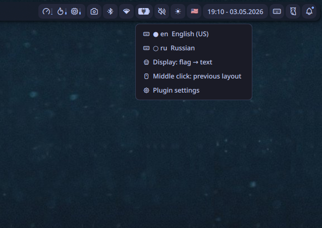
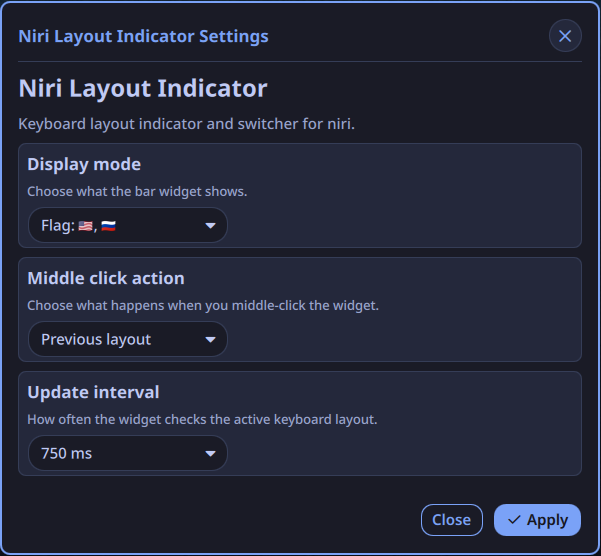

# Niri Layout Indicator





Keyboard layout indicator and switcher for Noctalia Shell on niri.
> Built for niri + Noctalia Shell on Wayland.

---
## ✨ Features

- Displays current keyboard layout (`en`, `ru`, etc. or flags)
- Switch layout with mouse:
  - **Left click** - next layout
  - **Middle click** - previous layout (or toggle display mode)
  - **Right click** - context menu
- Context menu:
  - Select layout directly
  - Toggle display mode (text / flag)
  - Change middle-click behavior
  - Open plugin settings
- Native Noctalia look and feel

---
## 🌍 Translations

- English (default)
- Russian

---
## ⚙️ Requirements

- [niri](https://github.com/YaLTeR/niri)
- Noctalia Shell

---
## 📦 Installation

Install the plugin from the Noctalia Plugin Store:

1. Open Noctalia Settings.
2. Go to Plugins.
3. Search for **Niri Layout Indicator**.
4. Press **Install**.
5. Add the widget to your bar.

---
## 🖱 Controls

| Action       | Result                   |
| ------------ | ------------------------ |
| Left click   | Next layout              |
| Middle click | Previous layout / toggle |
| Right click  | Open context menu        |

---
## 🧠 Notes

- Layout names are parsed from:

```bash
niri msg keyboard-layouts
```
- Language codes and flags are mapped manually
- Unknown layouts fall back to a generic 2-letter code

---
## 🚧 Future improvements

- Reactive updates (no polling)
- Custom layout mapping
- SVG flags
- Translations

---
## 📄 License

MIT

---
